# Project 1

## Milestone 1

## Serial Implementation

File `my_advection_program.c` contains the implementation of Advection Pseducode.

Commands to run the code:
`gcc my_advection_program.c -o my_advection_program -lm`
`./my_advection_program 400 10000 1.0 1.0e6 5.0e-7 2.85e-7`

The code will generate a guassian.txt (containing the initial values) and timestamp.txt (containing the values for selected n).

## Plotting

The plots are present in the `plots` folder for timestamps:
[100, 200, 500, 1000, 1500, 5000, 8000, 9000, 9500]

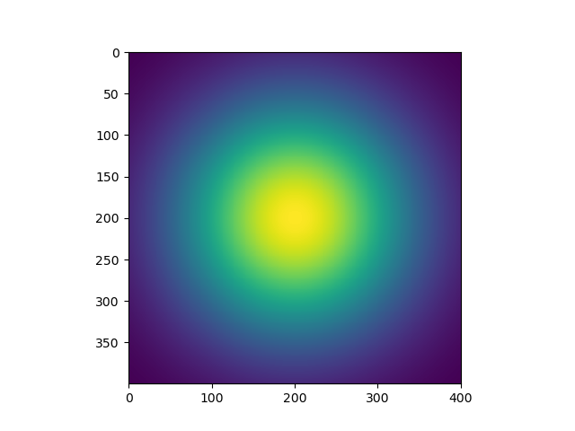
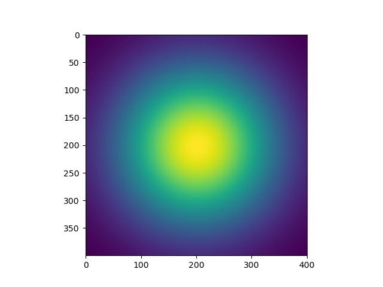
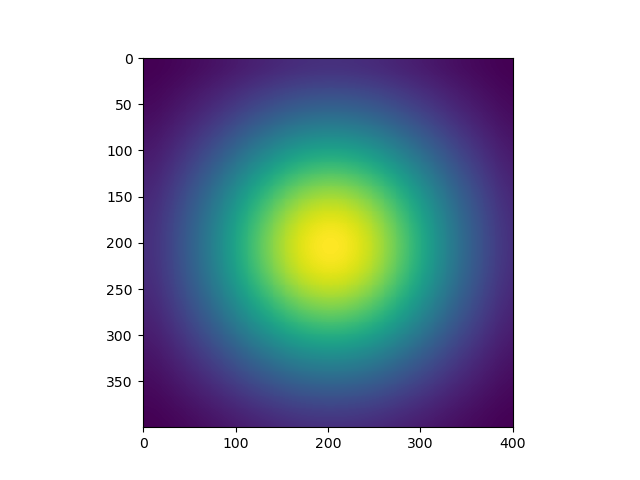
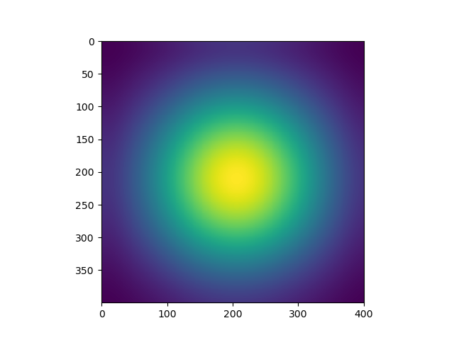

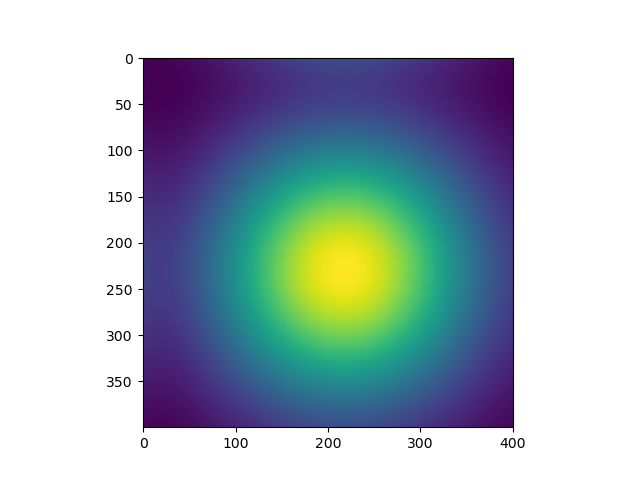
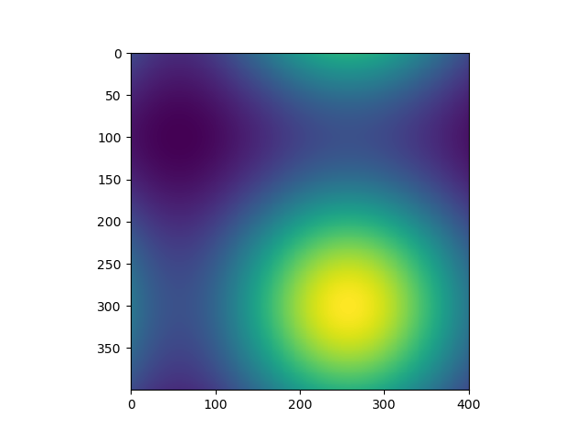
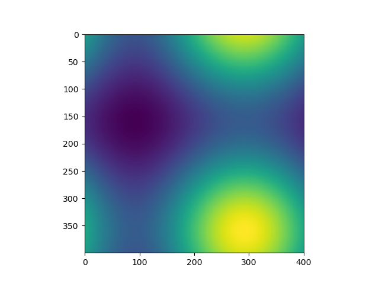
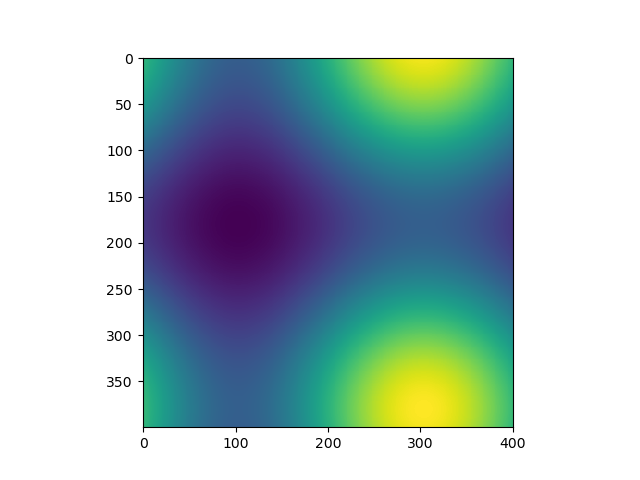
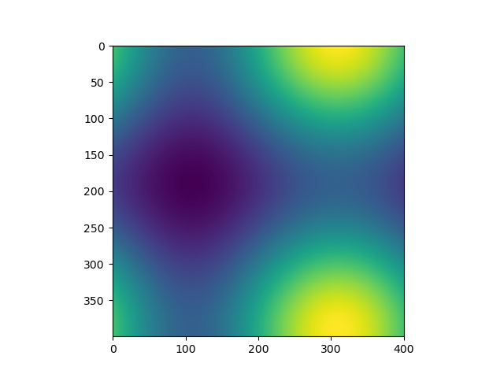

A gif is present as output.gif file created using the above mentioned plots.
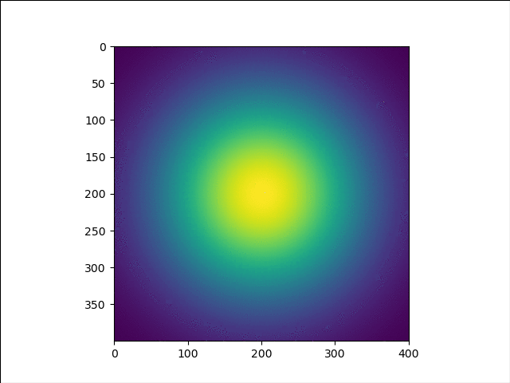

## Milestone 2

- Details of your processor and compiler choice for any data

- A demonstration that you get the same answer with the parallel and serial versions. Is bitwise
reproducibility expected?

- Your (best) grind rate (timesteps/s) using the parameters from Milestone 1 but on a problem with
N=10,000. This will be the standard value that we compare with each other in class.

The best performance was observed at 
- num_of_threads = 8 for outer loop
- num_of_threads = 8 for inner loop
- scheduled = static 
Time taken to execute the code for N = 10,000 varoed a lot on the linux server. But the best time taken was 578 sec.
According to this time the 
grid rate = N*N*NT/time
grid rate = 

- A plot of a strong scaling analysis using the following parameters:
∗ N = 3200
∗ NT = 400
∗ L = 1.0
∗ T = 1.0e3
∗ u = 5.0e-7
∗ v = 2.85e-7

- A plot of a second strong scaling study, using the same parameters as above but with N=200
For schedule = guided, N = 200, algo = first_order
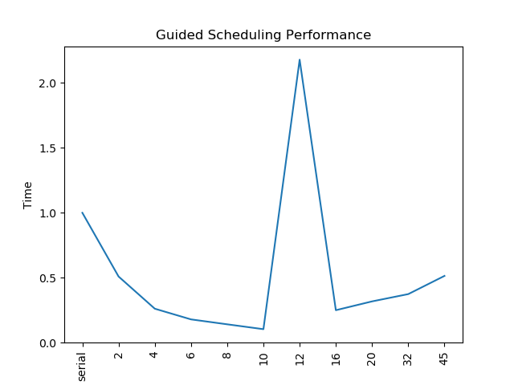

For schedule = lax, N = 200, algo = lax
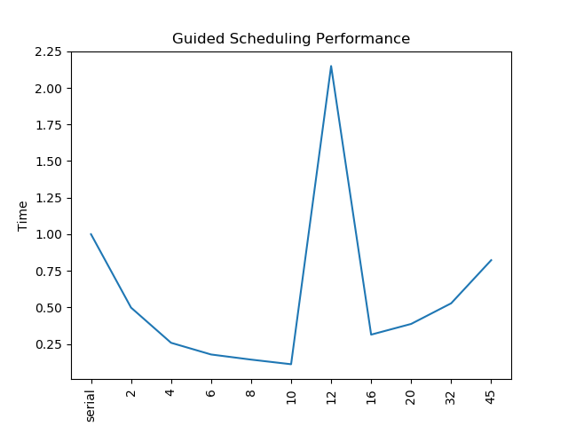

For schedule = guided, N = 200, algo = second_order
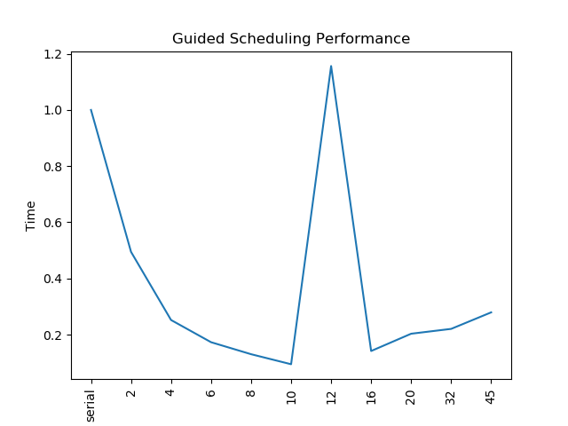

For schedule = static, N = 200, algo = lax
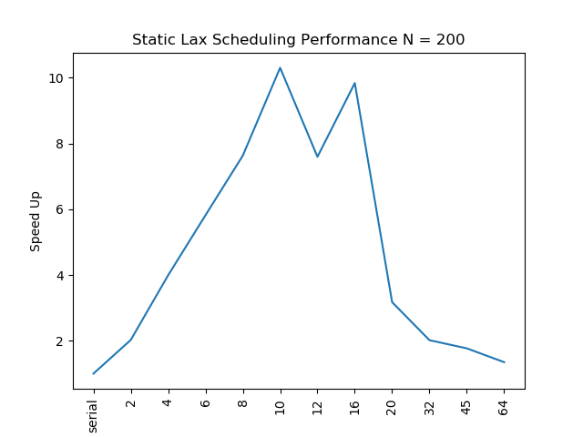

For schedule = static, N = 200, algo = second_order
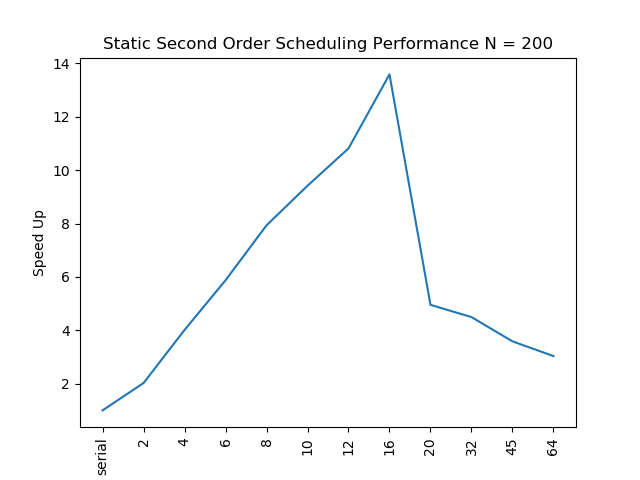

For schedule = static, N = 200, algo = first_order
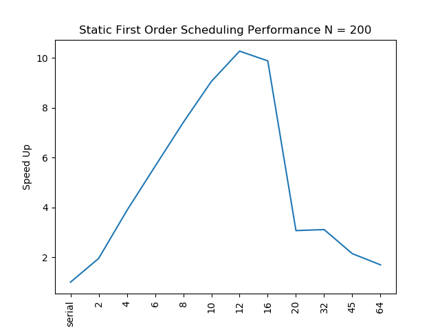

- A plot of a weak scaling analysis using the following parameters:
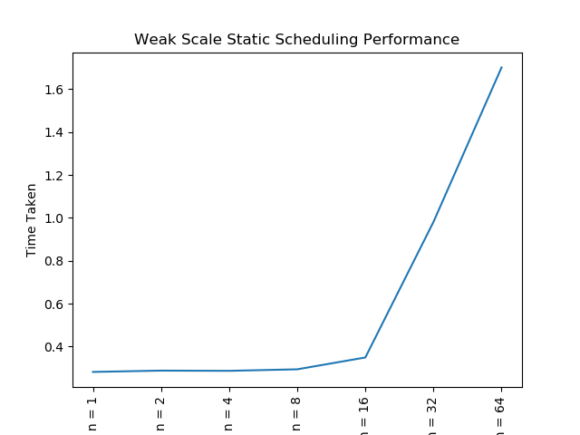

## Plots
